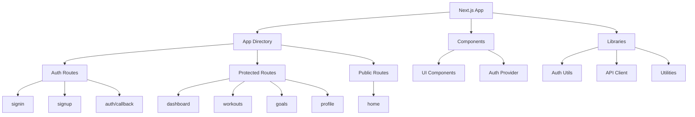
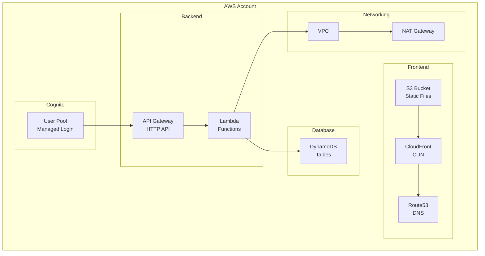
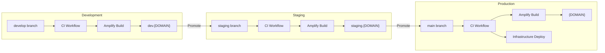
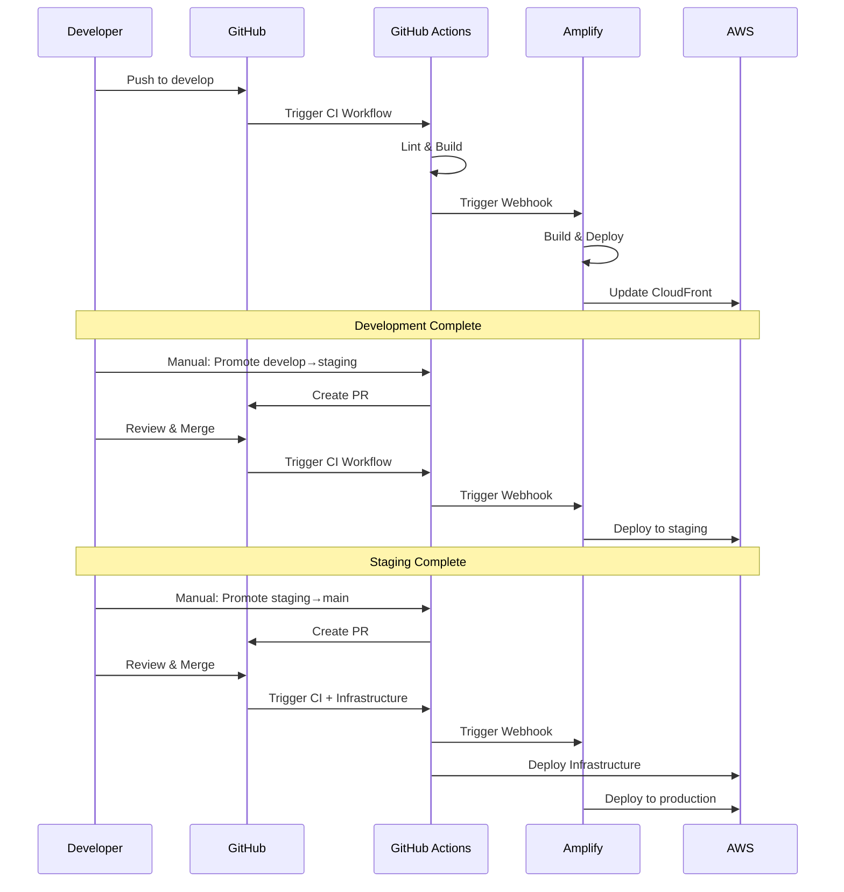

# YourPace

A modern fitness tracking application with enterprise-grade CI/CD infrastructure.

## Overview

YourPace is a Next.js-based fitness application with:
- **Frontend**: Next.js with Cognito authentication
- **Infrastructure**: AWS CDK with multi-environment support (dev, staging, production)
- **CI/CD**: GitHub Actions with automated testing, building, and deployment
- **Hosting**: AWS Amplify for frontend, CloudFront for CDN

## Architecture

### Frontend Structure



### Infrastructure Architecture



### CI/CD Pipeline



### Deployment Flow



## Project Structure

```
yourpace/
├── frontend/                 # Next.js frontend application
│   ├── app/                 # Next.js app directory
│   │   ├── (app)/           # Protected routes
│   │   ├── auth/            # Auth routes
│   │   └── layout.tsx       # Root layout
│   ├── components/          # React components
│   │   └── ui/              # UI components
│   ├── lib/                 # Utilities and helpers
│   └── package.json         # Frontend dependencies
├── infrastructure/          # AWS CDK infrastructure
│   ├── lib/                 # CDK constructs
│   │   ├── constructs/      # Reusable constructs
│   │   ├── lambdas/         # Lambda functions
│   │   └── stacks/          # CDK stacks
│   ├── bin/                 # CDK entry point
│   └── package.json         # Infrastructure dependencies
├── .github/
│   └── workflows/           # GitHub Actions workflows
│       ├── ci.yml           # CI checks and Amplify triggers
│       ├── deploy-infrastructure.yml  # Infrastructure deployment
│       └── promote.yml      # Promotion workflow
├── docs/                    # Documentation
│   ├── README.md            # CI/CD overview
│   ├── SETUP.md             # Setup guide
│   └── GITHUB_SECRETS.md    # Secrets configuration
└── README.md                # This file
```

## Environments

| Environment | Branch | URL | Auto-Deploy |
|-------------|--------|-----|-------------|
| Development | develop | https://dev.{DOMAIN} | On push |
| Staging | staging | https://staging.{DOMAIN} | On merge |
| Production | main | https://{DOMAIN} | On merge |

## Quick Start

### Prerequisites

- Node.js 20+
- AWS CLI configured with SSO profiles
- Git

### Local Development

**Frontend:**
```bash
cd frontend
npm install
npm run dev
# Open http://localhost:3000
```

**Infrastructure:**
```bash
cd infrastructure
npm install
npm run build
```

## Setup & Configuration

### For New Team Members

1. Read [`docs/README.md`](./docs/README.md) for overview
2. Follow [`docs/SETUP.md`](./docs/SETUP.md) for complete setup
3. Reference [`docs/GITHUB_SECRETS.md`](./docs/GITHUB_SECRETS.md) for secrets

### For Existing Setup

All sensitive configuration is stored in GitHub secrets. See [`docs/GITHUB_SECRETS.md`](./docs/GITHUB_SECRETS.md) for the complete list.

## Development Workflow

### Making Changes

1. Create a feature branch from `develop`
2. Make your changes
3. Push to your branch
4. Create a PR to `develop`
5. CI workflow runs automatically
6. After approval, merge to `develop`
7. Changes deploy to dev environment

### Promoting to Staging

1. Go to GitHub Actions → Promote workflow
2. Select "develop → staging"
3. Review the created PR
4. Merge the PR
5. Changes deploy to staging environment

### Promoting to Production

1. Go to GitHub Actions → Promote workflow
2. Select "staging → production"
3. Review the created PR
4. Merge the PR
5. Changes deploy to production environment
6. If infrastructure changed, deployment workflow runs with approval

## Security

### Best Practices

✅ **OIDC Authentication** - No long-lived AWS credentials in GitHub  
✅ **Secrets Management** - All sensitive values in GitHub secrets  
✅ **Destructive Change Detection** - Prevents accidental infrastructure deletion  
✅ **Manual Approvals** - Required for production infrastructure changes  
✅ **Branch Protection** - Enforced PR reviews before merging  
✅ **Audit Trail** - All deployments logged in GitHub Actions and AWS CloudTrail  

### Sensitive Information

⚠️ **Never commit:**
- AWS credentials or account IDs
- API keys or tokens
- Domain names or hosted zone IDs
- Amplify webhook URLs
- Any other secrets

All sensitive values must be stored in GitHub secrets.

## Troubleshooting

### CI Workflow Fails

1. Check GitHub Actions logs for error messages
2. Verify frontend builds locally: `cd frontend && npm run build`
3. Check Node.js version: `node --version` (should be 20+)

### Amplify Build Fails

1. Check Amplify console build logs
2. Verify environment variables are set correctly
3. Check frontend build locally

### Infrastructure Deployment Fails

1. Check CloudFormation events in AWS console
2. Verify AWS credentials and permissions
3. Check CDK context variables are passed correctly

### Webhook Not Triggering

1. Verify webhook URL in GitHub secrets
2. Check Amplify app webhook settings
3. Test webhook manually: `curl -X POST <WEBHOOK_URL> -H "Content-Type: application/json" -d '{}'`

## Documentation

- [`docs/README.md`](./docs/README.md) - CI/CD overview
- [`docs/SETUP.md`](./docs/SETUP.md) - Complete setup guide (8 phases)
- [`docs/GITHUB_SECRETS.md`](./docs/GITHUB_SECRETS.md) - Secrets configuration
- [`DEPLOYMENT_GUIDE.md`](./DEPLOYMENT_GUIDE.md) - Infrastructure deployment details
- [`COGNITO_MANAGED_LOGIN_GUIDE.md`](./COGNITO_MANAGED_LOGIN_GUIDE.md) - Authentication setup

## Support

For issues or questions:

1. Check the relevant documentation file
2. Review GitHub Actions logs for error messages
3. Check AWS CloudFormation events for infrastructure errors
4. Check Amplify build logs for frontend issues

## Contributing

1. Create a feature branch from `develop`
2. Make your changes
3. Ensure CI workflow passes
4. Create a PR with a clear description
5. Wait for approval and merge

## License

[Add your license here]

## Contact

[Add contact information here]

---

**Repository**: https://github.com/DigiAye/yourpace  
**Documentation**: See `docs/` directory  
**Last Updated**: February 20, 2026
