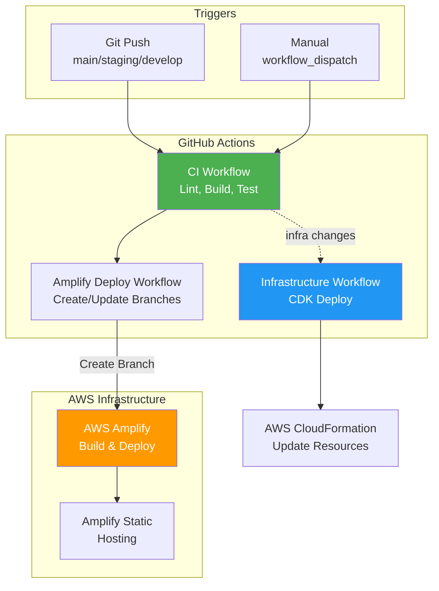
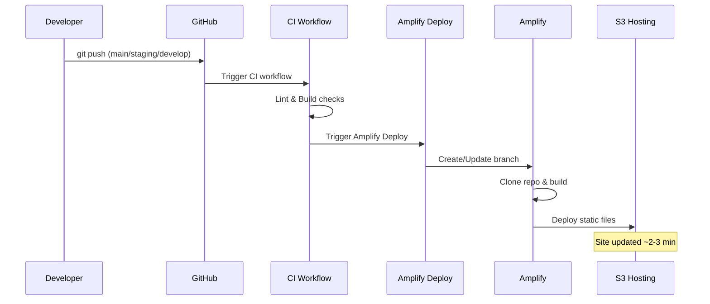
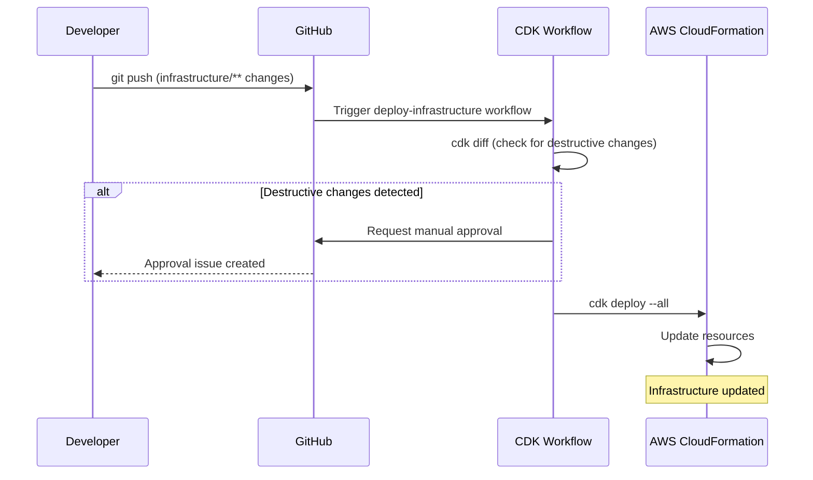

# YourPace CI/CD Pipeline Documentation

Complete deployment pipeline for YourPace, covering all automated workflows, Amplify hosting, and GitHub Actions integration.

## Overview

The YourPace application uses a multi-stage CI/CD pipeline that handles:
- **Code deployments** from Git pushes
- **Automated testing** via GitHub Actions
- **Infrastructure changes** via AWS CDK
- **Frontend deployments** via AWS Amplify

---

## Architecture Diagram



---

## Deployment Flows

### 1. Code Deployment (Git Push)



**Workflow Files:**
- `.github/workflows/ci.yml` - Main CI workflow
- `.github/workflows/amplify-deploy.yml` - Amplify deployment
- `.github/workflows/deploy-infrastructure.yml` - CDK deployment

**Key Points:**
- Amplify auto-build is **disabled** (GitHub OAuth limitation with CDK-created apps)
- Amplify Deploy workflow creates/updates branches via AWS CLI
- Builds only trigger after CI checks pass (quality gate)

---

### 2. Infrastructure Deployment (CDK)



**Workflow File:** `.github/workflows/deploy-infrastructure.yml`

---

## Component Details

### GitHub Actions Workflows

| Workflow | Trigger | Purpose |
|----------|---------|---------|
| `ci.yml` | Push to main/staging/develop | Lint, build, trigger Amplify Deploy |
| `amplify-deploy.yml` | Push to main/staging/develop | Create/update Amplify branches |
| `deploy-infrastructure.yml` | Push to main (infrastructure/**) | Deploy CDK stacks |

### Amplify Configuration

| Branch | Stage | Environment | Domain |
|--------|-------|-------------|--------|
| `main` | PRODUCTION | prod | yourpace.cloud |
| `staging` | BETA | staging | staging.yourpace.cloud |
| `develop` | DEVELOPMENT | dev | dev.yourpace.cloud |

**Build Settings:**
- Build command: `npm run build`
- Output: `frontend/out` (Next.js static export)
- Auto-build: **Disabled** (triggered via GitHub Actions)

### GitHub Secrets Required

| Secret | Purpose |
|--------|---------|
| `AWS_ACCOUNT_ID` | AWS account for deployments |
| `AWS_REGION` | AWS region (eu-west-1) |
| `AWS_DEPLOY_ROLE_ARN` | OIDC role for GitHub Actions |
| `DOMAIN_NAME` | Custom domain (yourpace.cloud) |
| `HOSTED_ZONE_ID` | Route53 hosted zone ID |
| `AMPLIFY_APP_ID_DEVELOP` | Amplify app ID for develop branch |
| `AMPLIFY_APP_ID_STAGING` | Amplify app ID for staging branch |
| `AMPLIFY_APP_ID_MAIN` | Amplify app ID for main branch |
| `AMPLIFY_WEBHOOK_DEVELOP` | Amplify webhook URL for develop |
| `AMPLIFY_WEBHOOK_STAGING` | Amplify webhook URL for staging |
| `AMPLIFY_WEBHOOK_MAIN` | Amplify webhook URL for main |

---

## Workarounds & Known Issues

### GitHub OAuth Connection (Amplify)

**Issue:** CDK-created Amplify apps lose GitHub OAuth connection, causing auto-builds to fail.

**Root Cause:** AWS is transitioning from OAuth to the Amplify GitHub App. CDK/CloudFormation apps using OAuth require manual console migration.

**Our Solution:** Use GitHub Actions to manage Amplify deployments.
- Amplify Deploy workflow creates/updates branches via AWS CLI
- Builds only trigger after CI checks pass (quality gate)
- No token management complexity

**Implementation:**
```yaml
# .github/workflows/amplify-deploy.yml
deploy-to-amplify:
  steps:
    - name: Deploy to Amplify
      run: |
        aws amplify create-branch \
          --app-id "$APP_ID" \
          --branch-name "$BRANCH" \
          --region "$AWS_REGION"
```

---

## Monitoring & Troubleshooting

### Check Build Status

```bash
# List recent Amplify builds
aws amplify list-jobs --app-id <APP_ID> --branch-name main \
  --region eu-west-1 --max-items 5

# Check Amplify branches
aws amplify list-branches --app-id <APP_ID> \
  --region eu-west-1
```

### View GitHub Actions Logs

```bash
# List recent workflow runs
gh run list --repo DigiAye/yourpace --branch develop --limit 5

# View specific workflow run
gh run view <run-id> --log
```

### Common Issues

| Symptom | Likely Cause | Solution |
|---------|--------------|----------|
| Changes not showing | Amplify build failed | Check Amplify console for build errors |
| Workflow fails "app not found" | App ID misconfigured | Verify AMPLIFY_APP_ID_* secrets |
| Build fails "repo not found" | OAuth broken | Use GitHub Actions workaround (already implemented) |
| Webhook returns 4xx | Secret misconfigured | Check GitHub secret values |

---

## Manual Operations

### Trigger Amplify Build Manually

```bash
# Using the webhook URL from GitHub Secrets
curl -X POST "$AMPLIFY_WEBHOOK_MAIN"

# Or using AWS CLI
aws amplify start-job --app-id <APP_ID> --branch-name main \
  --job-type RELEASE --region eu-west-1
```

### Re-run Failed CI Workflow

Via GitHub CLI:
```bash
gh run rerun <run-id>
```

### View Amplify Build Logs

```bash
# Get job details
aws amplify get-job --app-id <APP_ID> --branch-name main \
  --job-id <JOB_ID> --region eu-west-1

# View build log URL
aws amplify get-job --app-id <APP_ID> --branch-name main \
  --job-id <JOB_ID> --region eu-west-1 \
  --query 'job.steps[0].logUrl' --output text
```

---

## Security Considerations

1. **OIDC Authentication**: No long-lived AWS credentials stored in GitHub
2. **Webhook Tokens**: Stored as GitHub Secrets, not in code
3. **IAM Least Privilege**: GitHub Actions role has minimal permissions
4. **App IDs**: Stored as GitHub Secrets, not hardcoded

---

## Future Improvements

- [ ] Add deployment notifications (Slack/Discord)
- [ ] Implement preview environments for PRs
- [ ] Add smoke tests after deployment
- [ ] Set up monitoring dashboards in CloudWatch
- [ ] Add CloudFront cache invalidation on successful builds
- [ ] Implement CDK Amplify construct for infrastructure-as-code

---

## References

- [AWS Amplify Documentation](https://docs.aws.amazon.com/amplify/)
- [GitHub Actions Documentation](https://docs.github.com/en/actions)
- [AWS CDK Documentation](https://docs.aws.amazon.com/cdk/)
- [Next.js Static Export](https://nextjs.org/docs/app/building-your-application/deploying/static-exports)
