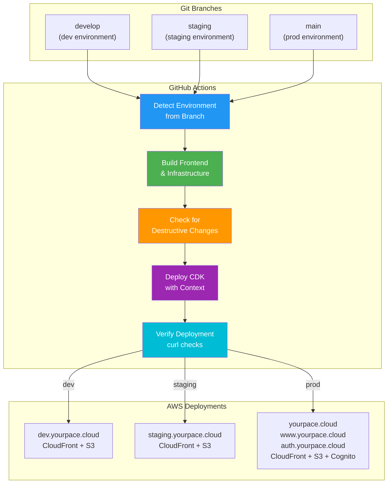
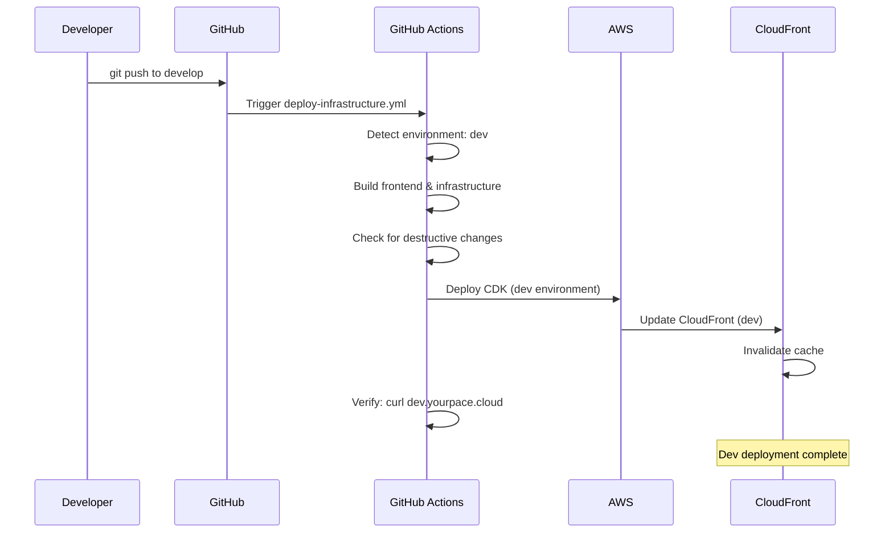
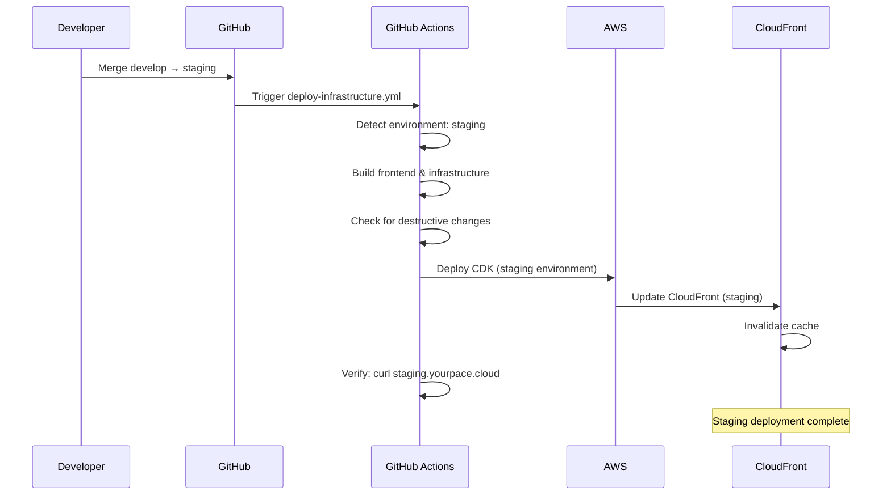
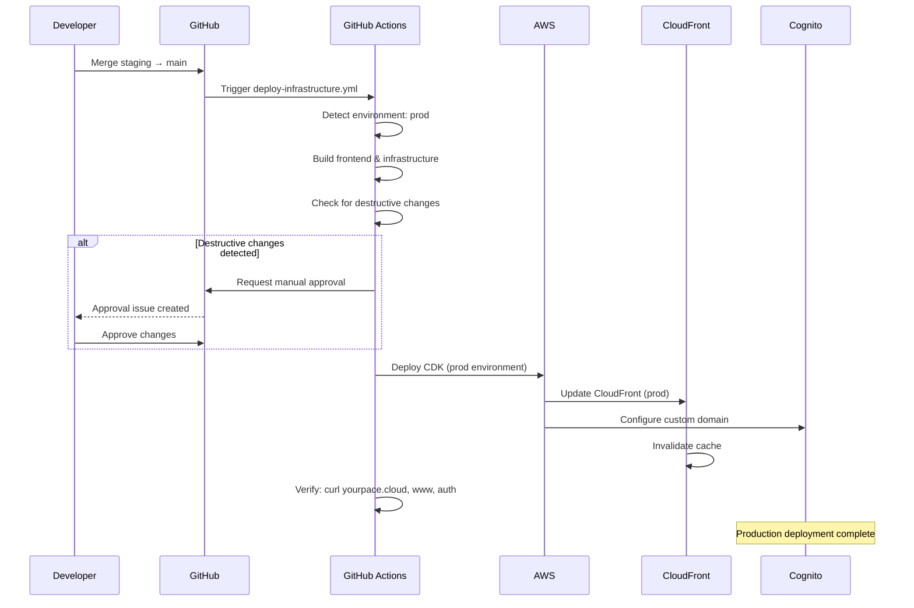

# YourPace CI/CD Pipeline Documentation

Complete deployment pipeline for YourPace, covering all automated workflows, infrastructure deployment, and multi-environment support.

## Overview

The YourPace application uses a multi-environment CI/CD pipeline that handles:
- **Multi-environment deployments** (dev, staging, production)
- **Automated infrastructure deployment** via AWS CDK
- **Frontend builds and deployments** via Amplify (with CloudFront + S3 fallback)
- **Automatic Amplify builds** triggered on frontend changes
- **Destructive change detection** with manual approvals
- **Post-deployment verification** with automated checks

---

## Architecture Diagram



---

## Deployment Flows

### 1. Development Deployment (develop branch)



### 2. Staging Deployment (staging branch)



### 3. Production Deployment (main branch)



---

## Workflow Details

### `.github/workflows/deploy-infrastructure.yml`

**Main infrastructure and frontend deployment workflow**

**Triggers:**
- Push to `main`, `staging`, or `develop` branches (infrastructure changes)
- Manual workflow dispatch with environment selection

**Jobs:**

1. **detect-environment**
   - Detects environment from branch (develop→dev, staging→staging, main→prod)
   - Sets environment-specific variables (domain, CloudFront IDs, Cognito domains)
   - Outputs environment context for deployment job

2. **deploy**
   - Builds frontend (Next.js)
   - Builds infrastructure (CDK)
   - Checks for destructive changes
   - Requests approval if destructive changes detected
   - Deploys CDK stacks with environment-specific context
   - Verifies deployment with curl checks

**Environment-Specific Context:**

```bash
# Development (develop branch)
-c env=dev
-c domainName=yourpace.cloud
-c cloudfrontCertificateArn=<CERT_ARN>

# Staging (staging branch)
-c env=staging
-c domainName=yourpace.cloud
-c cloudfrontCertificateArn=<CERT_ARN>

# Production (main branch)
-c env=prod
-c domainName=yourpace.cloud
-c cloudfrontCertificateArn=<CERT_ARN>
-c cognitoCertificateArn=<COGNITO_CERT_ARN>  # Production only
```

---

## Environment Configuration

| Environment | Branch | URL | CloudFront | Cognito Domain | Custom Domain |
|-------------|--------|-----|-----------|-----------------|---------------|
| **Development** | develop | https://dev.yourpace.cloud | Unique ID | yourpace-dev.auth.eu-west-1.amazoncognito.com | N/A |
| **Staging** | staging | https://staging.yourpace.cloud | Unique ID | yourpace-staging.auth.eu-west-1.amazoncognito.com | N/A |
| **Production** | main | https://yourpace.cloud<br/>https://www.yourpace.cloud<br/>https://auth.yourpace.cloud | Unique ID | yourpace-prod.auth.eu-west-1.amazoncognito.com | auth.yourpace.cloud |

---

## GitHub Secrets Required

19 secrets are configured for CI/CD automation:

**AWS Credentials:**
- `AWS_ACCOUNT_ID` - AWS account ID
- `AWS_REGION` - Primary region (eu-west-1)
- `AWS_REGION_US_EAST_1` - US East region (for CloudFront certificates)
- `AWS_DEPLOY_ROLE_ARN` - IAM role for GitHub Actions (OIDC)

**CloudFront:**
- `CLOUDFRONT_CERTIFICATE_ARN` - ACM certificate (us-east-1)
- `AWS_CLOUDFRONT_DISTRIBUTION_ID_PROD` - Production distribution ID
- `AWS_CLOUDFRONT_DISTRIBUTION_ID_STAGING` - Staging distribution ID
- `AWS_CLOUDFRONT_DISTRIBUTION_ID_DEV` - Dev distribution ID

**Cognito:**
- `COGNITO_USER_POOL_ID` - User Pool ID
- `COGNITO_USER_POOL_CLIENT_ID` - App Client ID
- `COGNITO_AUTH_DOMAIN_PROD` - Production auth domain
- `COGNITO_AUTH_DOMAIN_STAGING` - Staging auth domain
- `COGNITO_AUTH_DOMAIN_DEV` - Dev auth domain
- `COGNITO_CUSTOM_DOMAIN_ARN` - Certificate for custom domain (us-east-1)
- `COGNITO_CUSTOM_DOMAIN_NAME` - Custom domain name (auth.yourpace.cloud)
- `COGNITO_CLOUDFRONT_DOMAIN` - CloudFront domain for Cognito

**DNS:**
- `ROUTE53_HOSTED_ZONE_ID` - Route53 hosted zone ID

See [`GITHUB_SECRETS.md`](./GITHUB_SECRETS.md) for detailed configuration.

---

## Destructive Change Detection

The workflow automatically detects destructive changes:

```bash
npx cdk diff --all <context-args>
```

**Destructive changes include:**
- Resources being destroyed
- Resources being replaced
- Database table deletions
- S3 bucket deletions

**When detected:**
1. Workflow pauses and creates a GitHub issue
2. Requires manual approval from designated approvers
3. Approver reviews the changes in the issue
4. Approver comments "approved" to proceed
5. Deployment continues after approval

---

## Post-Deployment Verification

After successful deployment, the workflow verifies each environment:

**Development:**
```bash
curl -I https://dev.yourpace.cloud
```

**Staging:**
```bash
curl -I https://staging.yourpace.cloud
```

**Production:**
```bash
curl -I https://yourpace.cloud
curl -I https://www.yourpace.cloud
curl -I https://auth.yourpace.cloud/login
```

Expected response: **HTTP 200**

---

## Monitoring & Troubleshooting

### Check Workflow Status

```bash
# List recent workflow runs
gh run list --repo DigiAye/yourpace --branch develop --limit 5

# View specific workflow run
gh run view <run-id> --log

# Watch workflow in real-time
gh run watch <run-id>
```

### View CloudFormation Events

```bash
# List stack events
aws cloudformation describe-stack-events \
  --stack-name YourPaceStack \
  --region eu-west-1 \
  --query 'StackEvents[0:10]'
```

### Check CloudFront Distribution

```bash
# Get distribution status
aws cloudfront get-distribution \
  --id <DISTRIBUTION_ID> \
  --query 'Distribution.Status'

# List invalidations
aws cloudfront list-invalidations \
  --distribution-id <DISTRIBUTION_ID>
```

### Common Issues

| Symptom | Likely Cause | Solution |
|---------|--------------|----------|
| Workflow fails "environment not detected" | Branch name mismatch | Verify branch is main, staging, or develop |
| Deployment fails "secret not found" | Missing GitHub secret | Check all 19 secrets are configured |
| CloudFront returns 403 | S3 bucket policy issue | Verify OAC permissions in AWS console |
| Cognito domain stuck "CREATING" | DNS not propagated | Wait 5-10 minutes, check DNS CNAME record |
| Destructive change approval stuck | Approver not configured | Verify approver username in workflow |

---

## Manual Operations

### Trigger Deployment Manually

```bash
# Via GitHub CLI
gh workflow run deploy-infrastructure.yml \
  -f environment=prod \
  --repo DigiAye/yourpace
```

### Re-run Failed Workflow

```bash
gh run rerun <run-id>
```

### View Deployment Logs

```bash
# Get full logs
gh run view <run-id> --log

# Get specific job logs
gh run view <run-id> --log | grep "Deploy CDK"
```

---

## Security Considerations

1. **OIDC Authentication** - No long-lived AWS credentials stored in GitHub
2. **Secrets Management** - All sensitive values in GitHub Secrets (not in code)
3. **Destructive Change Detection** - Prevents accidental infrastructure deletion
4. **Manual Approvals** - Required for production infrastructure changes
5. **Branch Protection** - Enforced PR reviews before merging
6. **Audit Trail** - All deployments logged in GitHub Actions and AWS CloudTrail

---

## Performance Metrics

| Phase | Typical Duration |
|-------|------------------|
| Build frontend | 2-3 minutes |
| Build infrastructure | 1-2 minutes |
| Check for destructive changes | 1 minute |
| Deploy CDK | 5-10 minutes |
| Verify deployment | 1 minute |
| **Total** | **10-17 minutes** |

---

## Future Improvements

- [ ] Add deployment notifications (Slack/Discord)
- [ ] Implement preview environments for PRs
- [ ] Add smoke tests after deployment
- [ ] Set up monitoring dashboards in CloudWatch
- [ ] Add CloudFront cache invalidation on successful builds
- [ ] Implement automated rollback on deployment failure
- [ ] Add performance monitoring and alerts

---

## References

- [AWS CDK Documentation](https://docs.aws.amazon.com/cdk/)
- [GitHub Actions Documentation](https://docs.github.com/en/actions)
- [AWS CloudFormation Documentation](https://docs.aws.amazon.com/cloudformation/)
- [AWS Cognito Documentation](https://docs.aws.amazon.com/cognito/)
- [Next.js Deployment Guide](https://nextjs.org/docs/app/building-your-application/deploying)
